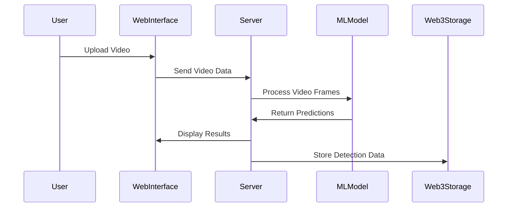

## Crime Detection using Machine Learning and Web3
> Revolutionizing public safety with real-time crime detection and decentralized data storage.


## Overview
The Crime Detection using Machine Learning and Web3 project is an advanced CCTV solution designed to enhance public safety by detecting criminal activities in video footage using cutting-edge machine learning techniques. By leveraging Web3 technologies, the project ensures that detected information is stored securely and in a decentralized manner, addressing the limitations of traditional CCTV systems that often rely on human intervention.

## Architecture & Workflow

The system architecture integrates machine learning for video analysis and Web3 for decentralized data storage. The workflow involves capturing video frames, processing them through a pre-trained model, and storing the results on a decentralized platform.



## Granular Tech Stack
- **Languages**: Python
- **Frameworks**: Django
- **Libraries**: OpenCV, PIL, PyTorch, Transformers
- **Tools**: ImageIO, Requests
- **Technologies**: Web3, Decentralized Storage

## Key Features
- Real-time video analysis for crime detection.
- Decentralized storage of detection data using Web3.
- User-friendly web interface for video upload and results display.
- High accuracy through pre-trained machine learning models.

## Project Structure
```
Crime-Detection-using-Machine-Learning/
├── .idea/
├── cctv_server/
│   ├── __init__.py
│   ├── asgi.py
│   ├── settings.py
│   ├── urls.py
│   └── wsgi.py
├── imagesend/
│   ├── __init__.py
│   ├── admin.py
│   ├── apps.py
│   ├── models.py
│   ├── serializers.py
│   ├── urls.py
│   └── views.py
├── models--google--vit-base-patch16-224/
├── main.py
├── manage.py
├── config.json
└── db.sqlite3
```

## Getting Started

### Prerequisites
- Python 3.x
- pip

### Installation
```bash
# Clone the repository
git clone https://github.com/AkhilAndroid/Crime-Detection-using-Machine-Learning.git
cd Crime-Detection-using-Machine-Learning

# Install the dependencies
pip install -r req.txt

# Download pre-trained models and videos
# Extract them to the root directory
```

### Running the project
```bash
# Start the Django server
python manage.py runserver

# Access the web interface
# Open http://127.0.0.1:8000 in your browser
```

## Usage
1. Open the web interface in your browser.
2. Upload a video file.
3. Click the "Detect" button to start crime detection.
4. View detected activities on the interface.
5. Data is securely stored using Web3 technologies.

## Roadmap
- Integration of additional machine learning models for improved accuracy.
- Expansion to support additional video formats and sources.
- Enhanced user interface features for better user experience.
- Implementation of real-time notifications for detected activities.

## Contributing
Contributions are welcome! Please fork the repository and submit a pull request for any enhancements or bug fixes.

## License
This project is licensed under the MIT License.
```
